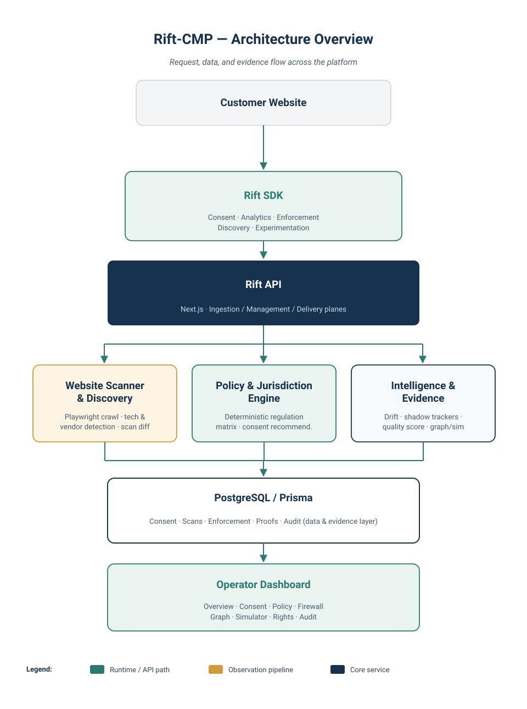

# Rift-CMP
### Consent Management & Privacy Intelligence Platform

> **Rift-CMP is a privacy platform that helps organizations discover what their websites collect and share, understand which privacy requirements may apply, manage visitor consent, enforce those choices, and continuously understand whether the website still matches its privacy policy.**


---

# Introduction

Every modern website collects or shares some form of data.

A visitor may encounter analytics tools, advertising technologies, chat widgets, payment services, embedded content, cookies, browser storage, and many other third-party technologies — often without knowing exactly what is happening behind the page they are viewing.

This creates a problem for both sides.

For visitors, it can be difficult to understand **what data is being used, why it is being used, and who may receive it**.

For organizations, privacy is no longer just about displaying a consent banner. They need to understand their website's actual behavior, determine which rules may apply, configure appropriate consent choices, respect those choices technically, maintain records, and identify changes when the website evolves.

**Rift-CMP was built to connect these pieces into one system.**

Instead of treating consent as a small banner placed in front of a website, Rift-CMP treats it as a complete lifecycle:

```text
                    WEBSITE
                       │
                       ▼
              Discover & Understand
                       │
                       ▼
              Regulatory Intelligence
                       │
                       ▼
                Consent Policy
                       │
                       ▼
             Visitor Consent Experience
                       │
                       ▼
                 Enforcement
                       │
                       ▼
                Consent Proof
                       │
                       ▼
             Analytics & Monitoring
                       │
                       ▼
             Detect Change & Improve
```

---

# What is a Consent Management Platform?

A **Consent Management Platform (CMP)** is a system that helps a website manage a visitor's choices about the use of personal data.

The simplest example is the familiar consent interface:

```text
┌─────────────────────────────────────────┐
│  We use cookies and similar technologies│
│  to improve your experience.             │
│                                         │
│  [ Reject All ] [ Manage Preferences ]  │
│              [ Accept All ]             │
└─────────────────────────────────────────┘
```

A real CMP, however, has to do much more than display these buttons.

It needs to connect a visitor's decision to the purposes and technologies behind the website, remember the decision, allow it to be changed, and help ensure that technologies do not operate contrary to that choice.

That is where Rift-CMP goes further.

### Traditional CMP

```text
Visitor
   ↓
Consent Banner
   ↓
Consent Record
```

### Rift-CMP

```text
Website
   ↓
What is actually running?
   ↓
What vendors & data flows exist?
   ↓
Which requirements may apply?
   ↓
What consent configuration is needed?
   ↓
What did the visitor choose?
   ↓
Was the choice enforced?
   ↓
Can the decision be proven?
   ↓
Did the website change afterwards?
```

---

# Why Now?

Privacy regulation is becoming increasingly important at the same time that websites are becoming more dependent on third-party technologies.

India is an especially relevant example.

The **Digital Personal Data Protection Act, 2023 (DPDP Act)** received Presidential assent on **11 August 2023**.

On **13 November 2025**, the Government notified the **Digital Personal Data Protection Rules, 2025** and a commencement notification for the Act. The framework uses a **phased commencement**, with different provisions taking effect at different times rather than the entire Act becoming operational on a single date.

The DPDP framework also introduces the concept of a **Consent Manager** — a platform through which a Data Principal can give, manage, review, and withdraw consent.

This makes the timing important: organizations increasingly need systems that can turn privacy requirements into something that can actually be operated across a website.

Rift-CMP is designed around that problem, while deliberately remaining **multi-regulation and jurisdiction-aware** rather than being a DPDP-only system.

---

# Why Rift-CMP?

A website can change without its privacy configuration changing with it.

A new analytics script can be added.

A vendor can change.

A third-party destination can appear.

A previously blocked technology can start communicating.

A new jurisdiction can become relevant.

A traditional consent workflow may continue to display the same banner while the underlying website has already changed.

Rift-CMP is designed to make these relationships visible.

### The core idea

> **Don't just ask visitors for consent. Understand what the website is doing, connect it to the rules that matter, enforce the resulting choices, and keep checking that reality still matches the policy.**

---

# Key Features

## 1. Website Privacy Discovery

Rift-CMP uses a real browser-based crawler to inspect websites and build a picture of their behavior.

It can discover:

- Pages and redirects
- Scripts and third-party resources
- Network activity
- Cookies
- Browser storage
- Technologies and vendors
- Destinations
- Consent-related signals

Instead of relying only on what a company says its website contains, Rift can observe what the website actually does during a scan.

This discovery layer becomes the foundation for the rest of the platform.

---

## 2. Vendor & Tracker Intelligence

Website activity is transformed into understandable privacy information.

Rift can connect observed signals to:

```text
Technology
     ↓
Vendor
     ↓
Destination
     ↓
Purpose
     ↓
Data Category
     ↓
Jurisdiction / Policy
```

When attribution is uncertain, Rift keeps that uncertainty visible instead of pretending the answer is known.

This is important because privacy decisions should be based on evidence rather than assumptions.

---

## 3. Regulatory & Jurisdiction Intelligence

Different websites can be subject to different privacy requirements.

Rift uses a structured, versioned policy system to represent regulatory requirements across multiple frameworks, including:

- GDPR
- EU ePrivacy
- India DPDP Act
- India DPDP Rules
- California CCPA/CPRA
- Brazil LGPD
- Selected US-state privacy material

The jurisdiction layer does not simply assume:

> **IP address → country → one law**

Instead, it can consider multiple applicable jurisdictions and provide confidence and reasoning for the result.

The policy engine remains deterministic and versioned, while AI can assist with explanation and ambiguity.

---

## 4. Consent Autopilot

Configuring consent manually can become difficult when a website contains dozens of technologies and multiple privacy requirements.

Rift's **Consent Autopilot** connects website discovery with regulatory intelligence to recommend a practical consent configuration.

```text
Website Scan
     +
Regulatory Requirements
     ↓
Recommended Configuration
     ↓
Evidence + Confidence
     ↓
Human Review
     ↓
Approved Policy
```

The goal is not to let AI decide what is legally correct.

The goal is to reduce repetitive configuration work while keeping the final policy under human control.

---

## 5. One-Snippet Consent Experience

Once a policy is approved, a company can integrate Rift through a single installation snippet.

The visitor receives a consent experience supporting:

- Accept all
- Reject all
- Manage preferences
- Purpose-level choices
- Consent withdrawal
- Accessible interaction

The browser receives the information required to operate the consent experience, while internal regulatory reasoning and policy intelligence remain on the platform.

This makes the integration simple for the website while keeping the privacy system centralized.

---

## 6. Consent Enforcement

Collecting a choice is only useful if the choice is respected.

Rift's browser SDK can enforce consent decisions across common browser request and resource mechanisms, including dynamically created resources.

Rift-controlled server-side boundaries can provide additional protection with decisions such as:

```text
ALLOW
BLOCK
REDACT
REQUIRE CONSENT
REVIEW
```

This creates the connection between:

```text
What the visitor chose
          ↓
What the website is allowed to do
```

rather than treating the consent record as a standalone database entry.

---

## 7. Shadow Trackers & Privacy Drift

One of Rift-CMP's key ideas is that **policy and reality can diverge**.

### Shadow Tracker Detection

Rift can surface activity that does not have an appropriate configuration, such as:

- Unconfigured technologies
- Missing purpose mappings
- Consent-required behavior observed without consent
- Blocked behavior that is still observed
- Unclassified behavior

### Drift Detection

Rift can also identify changes such as:

```text
Tracker Added
Tracker Removed
Tracker Changed
Vendor Added
Blocked Tracker Still Active
Consent Required but Unconfigured
Policy Ahead of Website
Website Ahead of Policy
```

This turns privacy monitoring into an ongoing process rather than a one-time website audit.

---

## 8. Consent Proof

Consent decisions can become important records.

Rift provides cryptographically verifiable consent proofs using:

- SHA-256 integrity
- Ed25519 signatures
- Sequence numbers
- Previous-proof hash chaining
- Versioned proofs
- Key rotation and verification

The purpose is to make it possible to verify the integrity and history of a recorded consent decision.

In simple terms:

> **Rift can provide evidence of what was recorded, under which policy context, and whether the record has been altered.**

This proves cryptographic facts about the record — it does not by itself prove legal compliance.

---

## 9. Consent Analytics & Experiments

Rift provides analytics specifically for understanding consent behavior.

Organizations can analyze consent by:

- Purpose
- Jurisdiction
- Policy version
- Mechanism
- Vendor
- Site

Rift also supports **consent A/B testing**.

Presentation variants can change elements such as:

- Title
- Description
- Accept All text
- Reject All text
- Manage text
- Save text

The underlying purposes, jurisdictions, policy, and enforcement rules remain unchanged.

This allows organizations to improve the consent experience without changing the privacy controls themselves.

---

## 10. Consent Quality

Rift provides a **Consent Quality Score** to give operators a high-level view of privacy configuration health.

It considers signals including:

- Consent coverage
- Policy completeness
- Enforcement coverage
- Tracker resolution
- Shadow trackers
- Scanner freshness
- Drift risk
- Jurisdiction coverage
- Proof completeness

The score is intended as an operational health indicator, not a legal certification or compliance guarantee.

---

## 11. Privacy Graph & Data Flow

Privacy information can become difficult to understand when it is spread across scanners, policies, consent records, and enforcement logs.

Rift brings these relationships together into a derived privacy graph.

```text
                     Purpose
                    /       \
                   ↓         ↓
Site → Page → Tracker → Vendor → Destination
          │        │         │
          ↓        ↓         ↓
       Policy   Enforcement  Data Category
          │
          ↓
     Jurisdiction
```

The graph can also connect findings, consent decisions, policy versions, and experiments.

This provides a visual way to answer:

> **Where can data move, why can it move, and what privacy controls are associated with that flow?**

---

## 12. Privacy Impact Simulator

Rift includes a simulator for exploring changes before applying them to production.

Examples:

```text
What happens if I add a tracker?
What happens if I remove a vendor?
What happens if another jurisdiction applies?
What happens if enforcement changes?
```

The simulator re-evaluates the resulting privacy state and can show potential changes to consent requirements, enforcement, shadow trackers, drift, and consent quality.

Simulations are hypothetical and do not modify production data.

---

## 13. Privacy Rights & Audit

Rift also provides workflows for recording privacy-rights requests such as:

- Access
- Correction
- Deletion
- Export
- Objection
- Restriction
- Withdrawal
- Opt-out requests
- Complaints and appeals

A unified audit view brings important platform activity together across consent, policies, scans, enforcement, rights, and experiments.

---

# End-to-End Workflow

```text
                    ORGANIZATION
                         │
                         ▼
                 Add Website to Rift
                         │
                         ▼
                  Website Discovery
                         │
          ┌──────────────┼──────────────┐
          ▼              ▼              ▼
       Trackers        Vendors       Data Flows
          │              │              │
          └──────────────┼──────────────┘
                         ▼
               Regulatory Intelligence
                         │
                         ▼
                 Consent Autopilot
                         │
                         ▼
                   Human Approval
                         │
                         ▼
                   Active Policy
                         │
                         ▼
              One-Snippet Integration
                         │
                         ▼
                  Visitor Consent
                         │
                         ▼
                    Enforcement
                         │
              ┌──────────┴──────────┐
              ▼                     ▼
         Consent Proof         Analytics
              │                     │
              └──────────┬──────────┘
                         ▼
               Monitoring & Drift
                         │
                         ▼
                  Continuous Improvement
```

---

# Platform Components

### Organization & Website Management

Organizations can manage websites, policies, configuration, installation, and verification from a centralized platform.

### Consent Layer

Handles consent configuration, visitor decisions, preference management, withdrawal, policy versions, and consent history.

### Discovery Layer

Uses browser-based scanning to understand website technologies, vendors, destinations, cookies, storage, and observed behavior.

### Intelligence Layer

Connects discovered behavior with purposes, data categories, jurisdictions, policy requirements, shadow findings, drift, and quality signals.

### Enforcement Layer

Applies consent decisions to browser activity and Rift-controlled outbound server-side flows.

### Evidence Layer

Maintains consent proofs, audit records, scan history, and evidence supporting privacy decisions.

### Operator Dashboard

Provides dedicated views for:

- Overview
- Websites
- Consent
- Policies
- Scans
- Intelligence
- Firewall
- Analytics
- Data Flow
- Privacy Graph
- Simulation
- Rights
- Audit
- Experiments
- Installation & Verification

---

# Architecture Overview

<p align="center">
  
</p>

---

# Project Structure

```text
Rift-CMP/
├── api/                    # Platform API and server logic
├── sdk/                    # Browser consent & enforcement SDK
├── crawler/                # Website discovery and scanning
├── policy/                 # Regulation & jurisdiction engine
├── database/               # Database models and persistence
├── shared/                 # Shared contracts and domain models
├── secure-transfer/        # Secure transfer proof of concept
├── rift-frontend-main/     # Dashboard and web interface
└── docs/
    └── regulations/        # Structured regulatory research
```

---

# Technology Stack

| Category | Technologies |
|---|---|
| Web Platform | TypeScript, Next.js, React |
| Browser SDK | TypeScript |
| Website Scanning | Playwright, Chromium |
| Database | PostgreSQL, Prisma |
| Policy Engine | Custom deterministic policy engine |
| AI Assistance | OpenAI / Anthropic |
| Validation | Zod, shared contracts |
| Testing | Vitest, browser-based tests |

---

# API

The platform exposes APIs for the major privacy workflows.

| Area | Purpose |
|---|---|
| Sites | Organization and website management |
| Scans | Website discovery and scan history |
| Consent | Decisions, configuration, history and proof |
| Policies | Purposes, notices and policy versions |
| Intelligence | Drift, shadow trackers and quality |
| Analytics | Website and consent analytics |
| Firewall | Outbound privacy enforcement |
| Experiments | Consent presentation testing |
| Rights | Privacy-rights request management |
| Graph | Privacy relationships and data flows |
| Simulation | Hypothetical privacy-impact analysis |
| Audit | Cross-domain activity history |

---

# Security & Design Principles

### Evidence over assumptions

Rift distinguishes between what was **observed**, what was **configured**, what was **inferred**, and what is **unknown**.

### Unknown is not permission

Missing information is not silently converted into an allow decision.

### Rules before AI

AI is used for assistance, explanation, classification, and prioritization. It does not replace the deterministic policy engine or independently approve privacy policy.

### Human approval

Automated recommendations remain recommendations until an operator approves them.

### Minimal exposure

The platform is designed to avoid unnecessarily storing sensitive values during discovery, enforcement, and operational workflows.

---

# Current Scope & Limitations

Rift-CMP is an engineering implementation of an end-to-end privacy platform. It intentionally has clear boundaries.

- Website discovery observes behavior exercised during a browser crawl; it cannot guarantee discovery of every possible behavior.
- Browser enforcement covers supported browser mechanisms but cannot guarantee control over every client-side bypass.
- Server-side firewall controls apply to traffic routed through Rift-controlled boundaries.
- Privacy-rights workflows record and manage requests but do not independently perform actions in external systems Rift cannot access.
- Secure Transfer is currently a proof of concept and has not received external cryptographic review.
- AI assistance is advisory and cannot determine legal compliance.
- Regulatory research is an engineering reference, not legal advice.
- DPDP Act and Rules provisions have phased commencement dates; the presence of a requirement in Rift's research model should not be interpreted as saying every provision is currently enforceable.

---

# Project Vision

Most consent systems begin with a question:

> **“What should the visitor click?”**

Rift-CMP starts with a much larger question:

> **“What is happening to data across this website, what privacy controls should apply, did those controls work, and can we prove what happened?”**

The vision is to make privacy management operate more like modern infrastructure:

```text
DISCOVER
   ↓
UNDERSTAND
   ↓
CONFIGURE
   ↓
ENFORCE
   ↓
PROVE
   ↓
MONITOR
   ↓
IMPROVE
```

Rift-CMP aims to move consent from a static banner into a **living privacy control layer for the website**.

---

# References

- [Digital Personal Data Protection Act, 2023 — MeitY](https://www.meity.gov.in/static/uploads/2024/02/Digital-Personal-Data-Protection-Act-2023.pdf)
- [Digital Personal Data Protection Rules, 2025 — MeitY](https://www.meity.gov.in/static/uploads/2025/11/53450e6e5dc0bfa85ebd78686cadad39.pdf)
- [Digital Personal Data Protection Rules, 2025 — MeitY](https://www.meity.gov.in/documents/act-and-policies/digital-personal-data-protection-rules-2025-gDOxUjMtQWa?pageTitle=Digital-Personal-Data-Protection-Rules-2025)
- [Explanatory Note on the DPDP Rules, 2025 — MeitY](https://www.meity.gov.in/writereaddata/files/Explanatory-Note-DPDP-Rules-2025.pdf)

> **Disclaimer:** Rift-CMP is a software and engineering project. Its regulatory models, recommendations, scores, and automated analysis are not legal advice, legal determinations, or certification of compliance.
